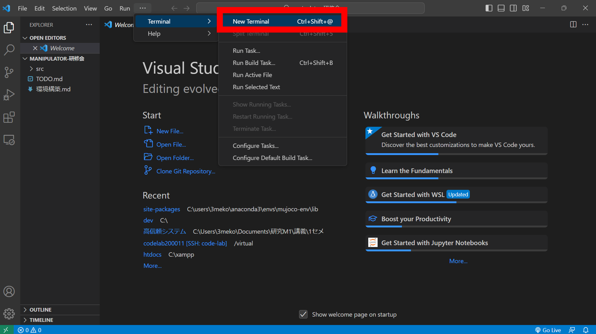
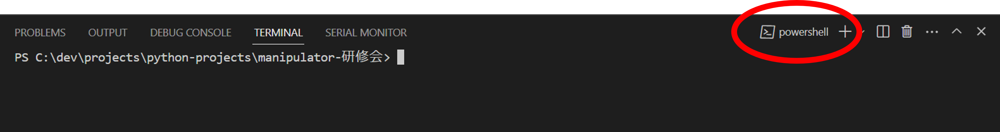
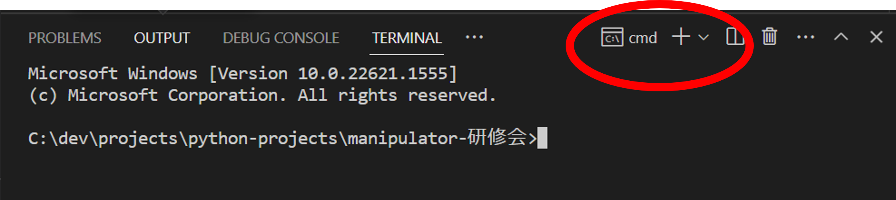
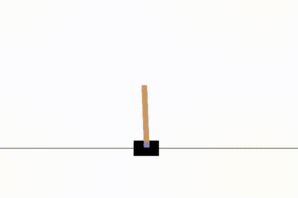

# Building a "gym" environment

As a premise,"anaconda" and "VScode" are already installed. 

## 1.Install "gym"

"gym" is a library for simulation.
We can't get started without this!

### 1.1 Open terminal in VSCode

Click "new Terminal" and open terminal.

### 1.2 Open commandprompt
In case powershell are opened, select comandprompt.

(Bad example)using powershell 
(You can't use "conda" in powershell if you use windows.(We don't know why.))

(good example)using comandprompt (We can use "conda" in comandprompt)

### 1.3 Activate anaconda

Type the following at the commandprompt.

~~~
C:\Users\{user name}\anaconda3\Scripts\acitvate
~~~

### 1.4 Create vertual environment & activate

Type the following at the commandprompt.

~~~
conda create -n manipulator-env python=3.7
conda activate manipulator-env
~~~

- *python should be version3.7
- *If you use windows and select version3.9 or higher ,you can't use render in gym (drawing animation in gym)

Setting of vertual environment is now completed!

### 1.5 Install "gym"

Install "gym" with the following code.

~~~
pip install gym==0.15.3
~~~

Be careful of the version! You can't use "mujoco" in higher version. 

### 1.6 Try to see if the "gym" works.

Run the following program.

~~~python
import gym
import time

def main():

    env=gym.make("CartPole-v1")
    env.reset()
    for _ in range(100):
        s,_,_,_,=env.step(env.action_space.sample())
        print(s)
        env.render()
        time.sleep(0.1)
    env.close()

if __name__=="__main__":
    main()
~~~

If the following screen appears, you have succeeded!

