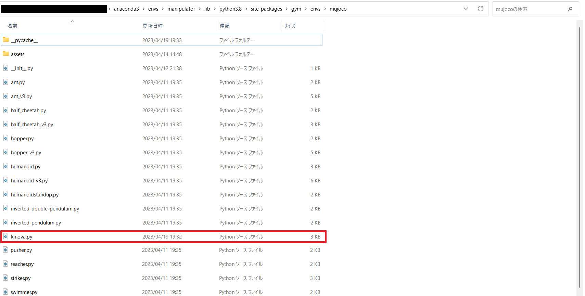
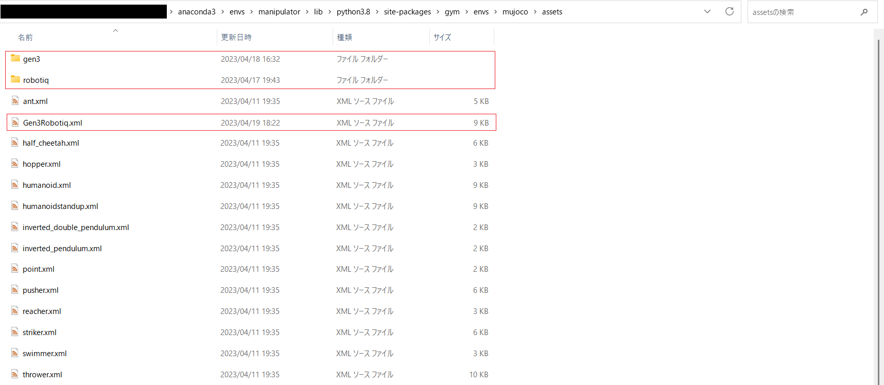
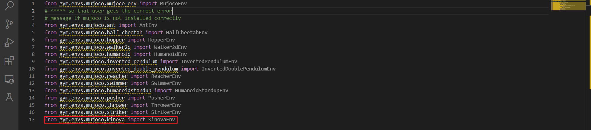

# Setting manipulator

## 1 Put files to each folders

### 1.1 Create workspace folder

Create workspace folder wherever you like.

### 1.2 Put files to workspace folder

Put "test.py" and "controller.py" to workspace folder.

### 1.3 Put env python files to gym env folder

Put "kinova.py" to "~\anaconda3\envs\{env name}\lib\python3.8\site-packages\gym\envs\mujoco".

### 1.4 Put model file and folders to asset folder

Put "Gen3Robotiq.xml" and "gen3","robotiq" to "~\anaconda3\envs\{env name}\lib\python3.8\site-packages\gym\envs\mujoco\assets".

## 2  Overwrite each files

### 2.1 Overwrite _init_ (1)

Write the following to "~\anaconda3\envs\manipulator\lib\python3.8\site-packages\gym\envs\__init__.py".

register(
    id='Kinova-v0',
    entry_point='gym.envs.mujoco:KinovaEnv',
    max_episode_steps=50,
)

### 2.2 Overwrite _init_ (2)

Write the following to "~\anaconda3\envs\manipulator\lib\python3.8\site-packages\gym\envs\mujoco\__init__.py".

from gym.envs.mujoco.kinova import KinovaEnv

