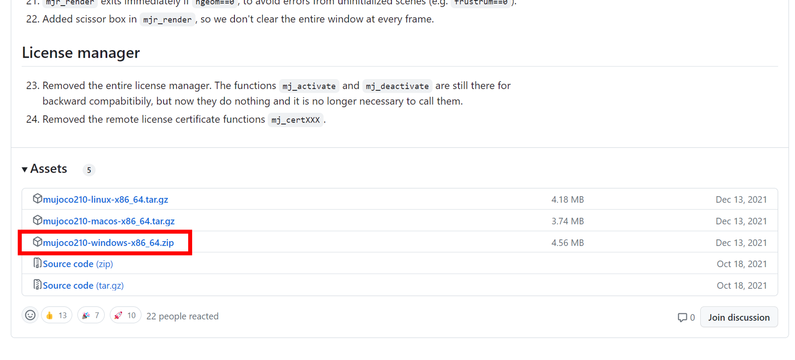
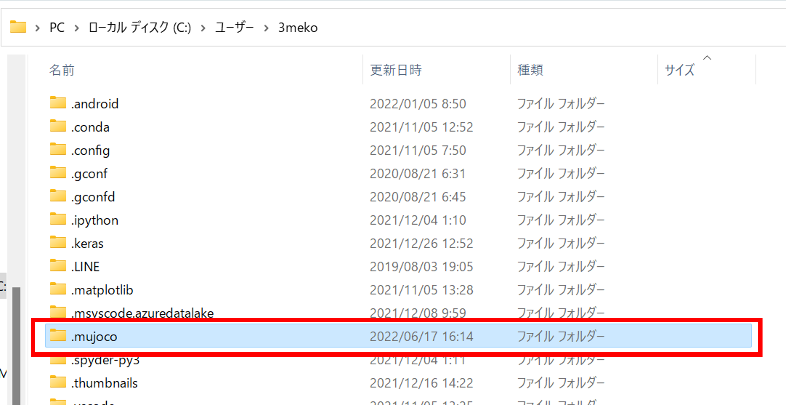
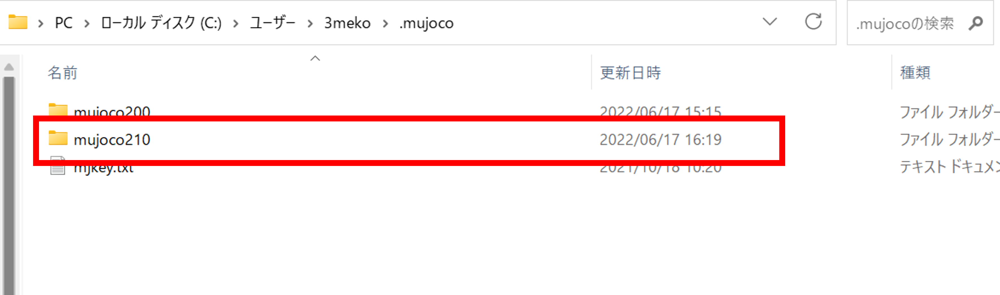
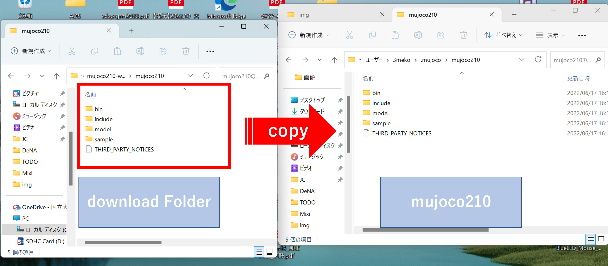
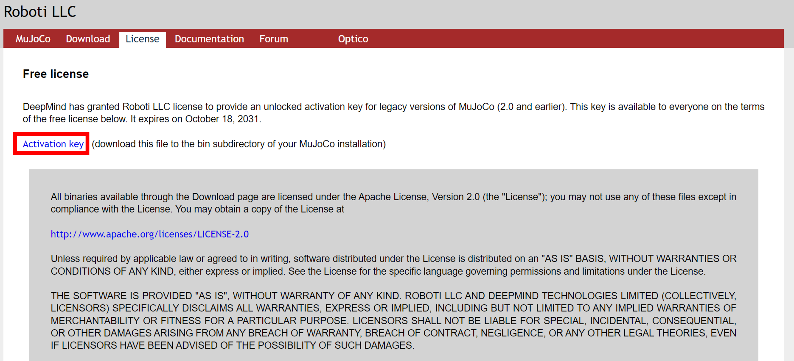
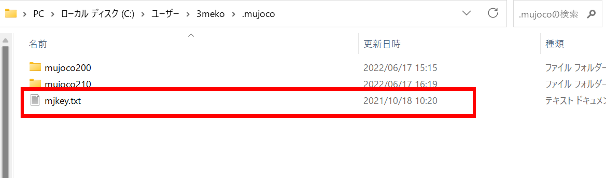
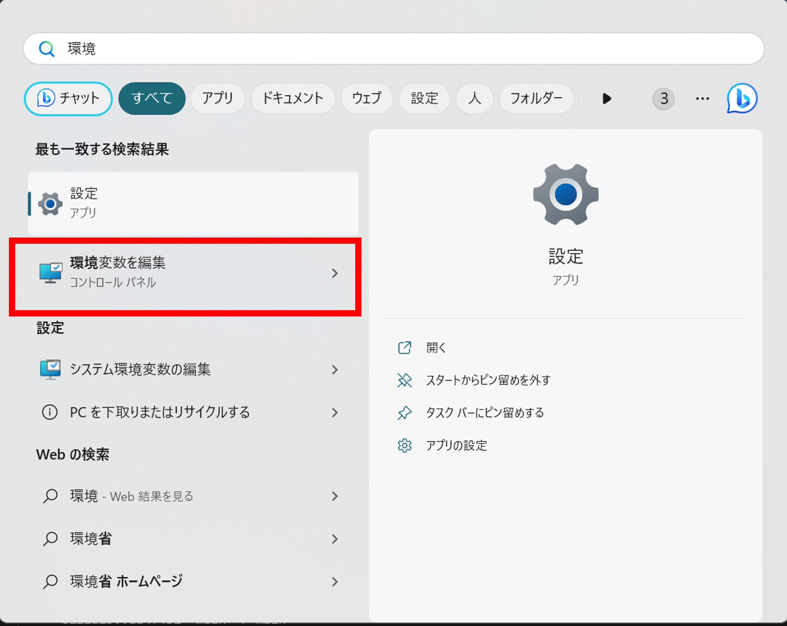
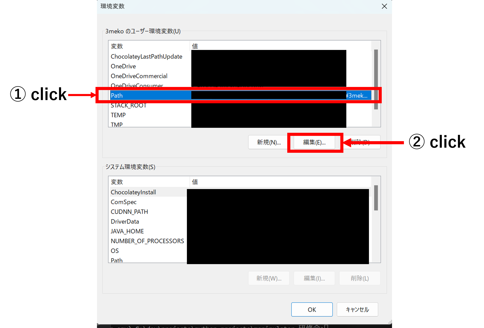
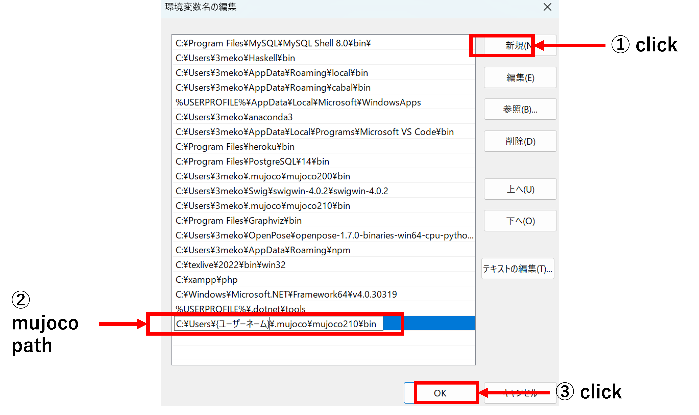

# mujocoの環境構築

gymをいれたら、次にmujocoを入れます。

ざっくりとした違いは、gymは2Dで、mujocoは3Dです。

## 1. mujocoダウンロード

↓こちらのリンクにアクセスします。

https://github.com/deepmind/mujoco/releases/tag/2.1.0

「mujoco210-windows-x86_64.zip」をダウンロード&解凍します。(どこでもいい)

## 2. .mujocoフォルダの作成

C:\\Users\\{自分のユーザーネーム}

に「.mujoco」フォルダを作成します。

### 作ったのに.mujocoファイルが見えないとき

隠しフォルダを見えるように設定します。

## 3. mujoco210フォルダの作成

今作った .mujoco フォルダの中に「mujoco210」フォルダを作成します。

## 4. mujoco210フォルダにダウンロードしたファイルをコピー

ダウンロードしたファイルの中身をmujoco210フォルダの中にコピーします。

## 5. mujocoのライセンスキーの取得

このままではmujocoファイルにはロックが掛かっているので使えません。

そのためアクセスキーをダウンロードします。

↓こちらのリンクにアクセスします。

https://www.roboti.us/license.html

「Activation Key」をクリックしてアクセスキーをダウンロードします。

## 6. ライセンスキーの配置

ダウンロードしたライセンスキーを.mujocoフォルダに移動します。

## 7. mujocoのパスを通す

mujocoのパスをパソコンの環境設定に登録していきます。

### 7.1 環境設定画面を開く

「環境」と検索し、
「環境変数を変更」パネルを開きます。

### 7.2 環境パス編集画面を開く

次に「ユーザー環境変数」の「path」を選択します。
その後、「編集」をクリックします。

## 7.3 パスの追加

「新規」ボタンをクリックし、

~~~
C:\Users\{ユーザーネーム}\.mujoco\mujoco210\bin 
~~~

を追加し、「OK」をクリックします。

(「\」はWindowsキーだと「¥」を押す)

これでpathが通ったのパソコンを再起動しときましょう。

## 8. mujoco-pyのpip install

mujocoに必要なライブラリをインストールします。

VSCodeからターミナルを開きます。

※comandpromptを開く。powershellじゃダメ。

pythonの仮想環境が有効化されてない時はactivateします。

~~~
conda activate manipulator-env
~~~

pipでmujoco-pyをインストールします。

バージョンは必ず2.1.2.14にします。

~~~
pip install mujoco-py==2.1.2.14
~~~

## 一旦テストプログラムを動かしてみる

ほぼ100%エラーが出ると思いますが一旦動かしてみます。

(パソコンでアプリのビルドとかしたことある人とかなら1発でいけるかもしれない)

~~~python
import gym
import time

def main():

    env=gym.make("Ant-v3")
    env.reset()
    for _ in range(100):
        s,_,_,_,=env.step(env.action_space.sample())
        env.render()
        time.sleep(0.05)
    env.close()

if __name__=="__main__":
    main()
~~~

上手くいくと、4脚のアリがバタバタする動画がでます。

# エラーの解消

## Visual C ++ がないとき

おそらくほとんどの人が以下のエラーが発生します。

~~~
error: Microsoft Visual C++ 14.0 or greater is required. Get it with "Microsoft C++ Build Tools": https://visualstudio.microsoft.com/visual-cpp-build-tools/
~~~

これはC++のビルドツールがないエラーなので、「Visual Studio」をインストールしていきます。

※Visual StudioをインストールするとC++のビルドツールが一緒に入ってきます。

※C++ビルドツールだけインストールすることもできますが、うまくいかなかったのでVisual Studioごと入れたほうが無難です。

↓こちらのリンクをクリックし、「Visual Studio」をダウンロードします。

https://visualstudio.microsoft.com/ja/thank-you-downloading-visual-studio/?sku=Community&channel=Release&version=VS2022&source=VSLandingPage&passive=false&cid=2030

クリックすると自動でダウンロードされます。

ダウンロードが完了したら vs_community_XXXXXXXXXXXX.exeをクリックしてインストールします。

そこそこ時間がかかるのでしばらく待ちましょう。

インストールが完了したら再起動し、もう一度テストプログラムを実行しましょう。