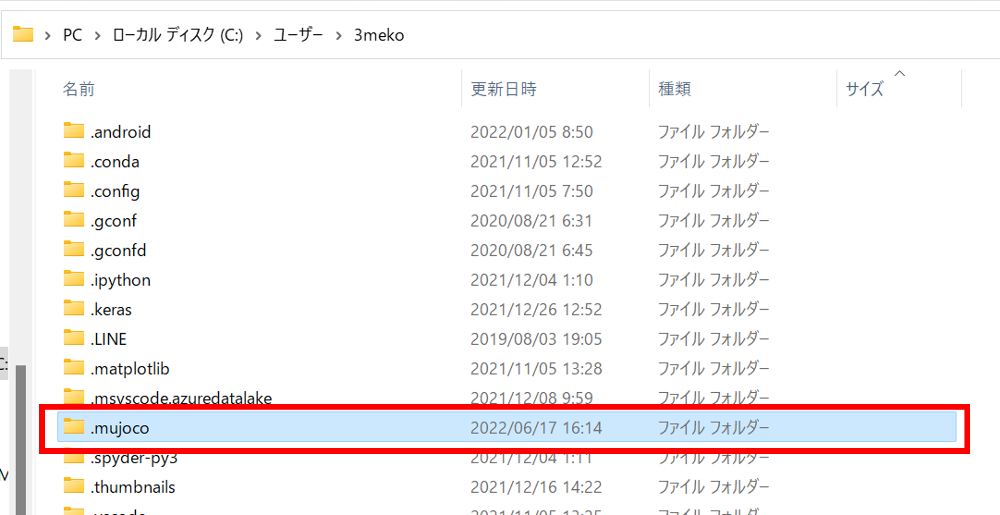
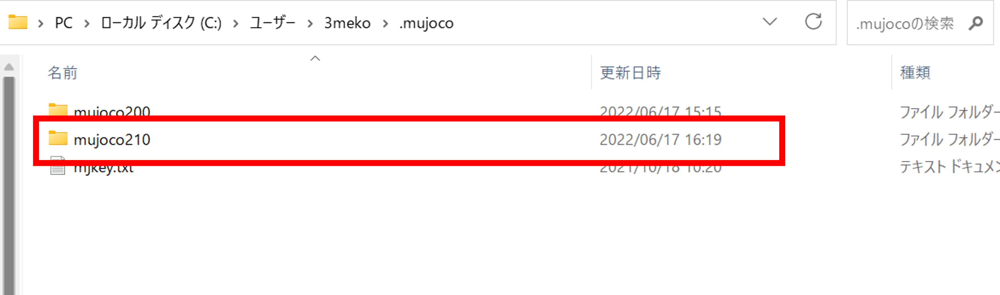
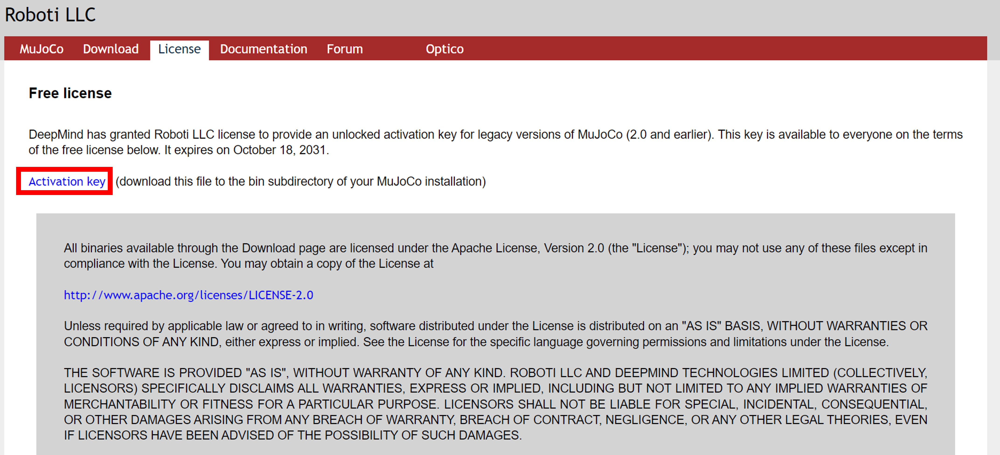
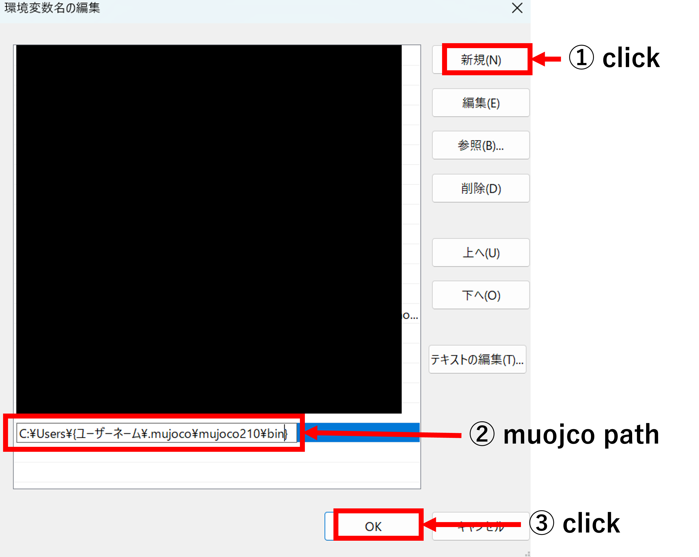
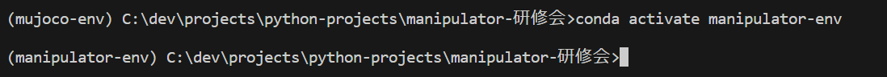

# Building a mujoco environment 

After installed "gym", let's install mujoco.

The differnce of "gym" and "mujoco" is "mujoco" can make 3D environment in contrast "gym" makes 2D environment.

## 1. Download mujoco

Go to the link below.

https://github.com/deepmind/mujoco/releases/tag/2.1.0

Download "mujoco210-windows-x86_64.zip"and unzip. (wherever you want)

## 2. Create ".mujoco" folder

Create ".mujoco" folder at "C:\\Users\\{User name}".

### In case you can't see ".mujoco" folder although you create folder.

Set hidden folders to be visible.

## 3. Create "mujoco210" folder 

Create "mujoco210" folder in the ".mujoco" folder.

## 4. Copy contents of the downloaded file to "mujoco210".

## 5. Get a "license key" of mujoco.

As it is, the mujoco file is locked and cannot be used.

So, we need to download licence key.

Go to the link below.

https://www.roboti.us/license.html

Press "Activation Key" and download the key.

## 6. Put the licence key

Move the licence key("mjkey.txt") to ".mujoco" folder.

## 7. Set the path for mujoco

Setting the path and variables.

### 7.1 Open "Edit environment variables for your account"

Open the Start menu and type "edit ENV" into the search bar.
Tap "Edit environment variables for your account".

### 7.2 Open "Edit Environment Variable"

Choose "path" and press "Edit".

## 7.3 Add path

Click "New" and add

~~~
C:\Users\{User name}\.mujoco\mujoco210\bin 
~~~

then click "OK".

(In Windows "\" is "¥")

Now that the path has been set, restart the PC.

## 8. Install mujoco-py 

Install libraries for mujoco.

### (1)

Open terminal in VSCode.

*Open comandprompt not powershell.

Activate virtual environment if not actevated.

~~~
conda activate manipulator-env
~~~

### (2)

Install "mujoco-py" by pip

The version must be 2.1.2.14.

~~~
pip install mujoco-py==2.1.2.14
~~~

## Run the test program

You'll get an error 100%, but try to run it.

(You are lucky if could run it without errors.)

~~~python
import gym
import time

def main():

    env=gym.make("Ant-v3")
    env.reset()
    for _ in range(100):
        s,_,_,_,=env.step(env.action_space.sample())
        env.render()
        time.sleep(0.05)
    env.close()

if __name__=="__main__":
    main()
~~~

If you succeed, you can see an ant moves randomly.

# Error Resolution

## Lack of Visual C ++ 

Most people get the following error.

~~~
error: Microsoft Visual C++ 14.0 or greater is required. Get it with "Microsoft C++ Build Tools": https://visualstudio.microsoft.com/visual-cpp-build-tools/
~~~

This is an error that does not have a C++ build tool, so we will install "Visual Studio".

↓Click following link and download "Visual Studio".

https://visualstudio.microsoft.com/ja/thank-you-downloading-visual-studio/?sku=Community&channel=Release&version=VS2022&source=VSLandingPage&passive=false&cid=2030

(Click to download automatically.)

After the download is complete, click "vs_community_XXXXXXXXXXXX.exe" and install it.

It takes much time ,so wait patiently.

After the install is complete, restart PC and try running the test program.
