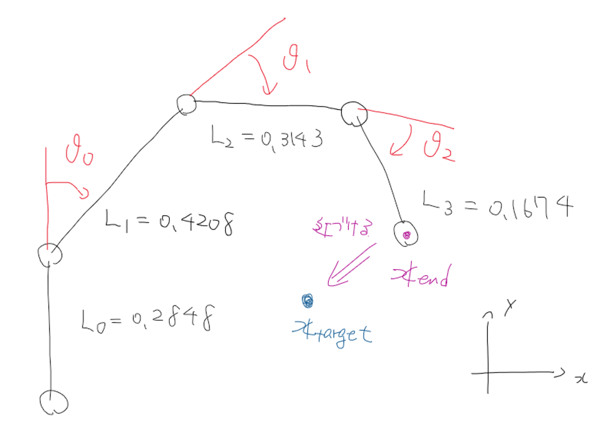
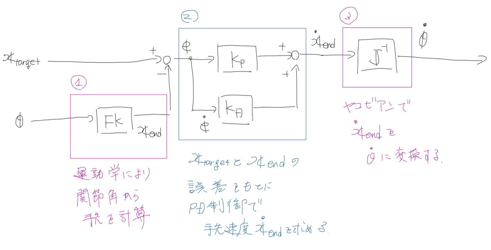
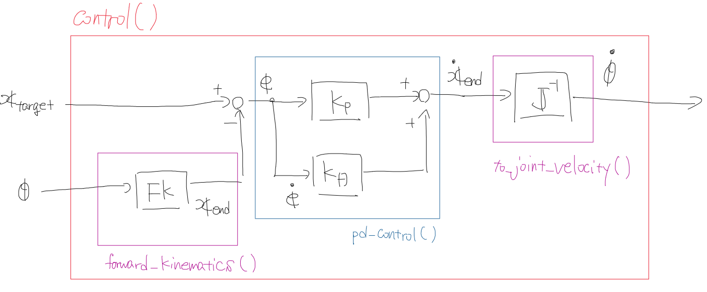

# マニピュレーター会課題

「目標位置」と「今の関節角度」からヤコビ行列を使って、「必要な各関節の速度」を計算するコードを書こう

## ロボットアームの座標系について

アームの座標系は以下のようになっています。

また、各変数は表のように表します。

|変数|役割|
:---:|:---:
|$x_{end}$|アームの手先|
|$x_{target}$|アームの目標位置|
|${\theta}$|関節角度 [ $${\theta}_{0} {\theta}_{1} {\theta}_{2}$$ ] |

課題では,$x_{end}$が$x_{target}$に近づくような関節角速度$\dot{\theta}$を計算するコードを書きます。

## ロボットアームの制御について

アームの制御は以下の流れで行います。

1. 運動学によって現在の関節角度${\theta}$を現在の手先位置$x_{end}$に変換
1. 目標位置$x_{target}$と$x_{end}$の差${e}$をもとに、PD制御によって手先速度$\dot{x_{end}}$を求める
1. ヤコビアンを使って$\dot{x_{end}}$から関節角速度$\dot{\theta}$を求める
1. $\dot{\theta}$で現在の${\theta}$を更新し、1にもどる

皆さんには、**1と3の処理を行うコード**を書いてもらいます。

## 課題について

課題は**controller_quiz.py**に**1と3の処理を行うコード**を追加してもらうことになります。

### Controllerクラスについて

**controller_quiz.py**にはあらかじめロボットアームを制御する用のContollerクラスが用意してあります。  
Contollerクラスの関数は以下のようになっています。

**Controller**
|関数名|役割|
:---:|:---:
|forward_kinematics(${\theta}$)|運動学で${\theta}$から$x_{end}$を計算. 処理の1相当|
|pd_control($x_{target},x_{end},kp,kd$)|PD制御で$\dot{x_{end}}$を計算. 処理の2相当|
|to_joint_velocity($\dot{x_{end}}, {\theta}$)|ヤコビ行列を用いて$\dot{\theta}$を計算. 処理3に相当|
|control(${\theta},x_{target},kp,kd$)|処理の1,2,3を一気に行う関数. 制御の際にはこの関数だけ使えばok|

また、ブロック線図と関数の対応は以下のようになっています。

