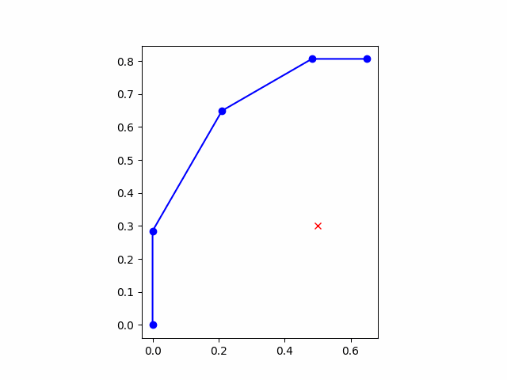

# マニピュレーター会課題

「目標位置」と「今の関節角度」からヤコビ行列を使って、「必要な各関節の速度」を計算するコードを書こう

## ロボットアームの座標系について

アームの座標系は以下のようになっています。

また、各変数は表のように表します。

|変数|役割|
:---:|:---:
| $x\_{end}$ |アームの手先|
| $x\_{target}$ |アームの目標位置|
| ${\theta}$ |関節角度 [  ${\theta}\_{0} , {\theta}\_{1} , {\theta}\_{2}$  ] |

課題では,  $x\_{end}$  が $x\_{target}$ に近づくような関節角速度 $\dot{\theta}$ を計算するコードを書きます。

## ロボットアームの制御について

アームの制御は以下の流れで行います。

1. 運動学によって現在の関節角度 ${\theta}$ を現在の手先位置 $x\_{end}$ に変換
1. 目標位置 $x\_{target}$ と $x\_{end}$ の差 ${e}$ をもとに、PD制御によって手先速度 $\dot{x\_{end}}$ を求める
1. ヤコビアンを使って $\dot{x\_{end}}$ から関節角速度 $\dot{\theta}$ を求める
1.  $\dot{\theta}$ で現在の ${\theta}$ を更新し、1にもどる

皆さんには、**1と3の処理を行うコード**を書いてもらいます。

## 課題について

課題は**controller\_quiz.py**に**1と3の処理を行うコード**を追加してもらうことになります。

### Controllerクラスについて

**controller_quiz.py**にはあらかじめロボットアームを制御する用のControllerクラスが用意してあります。  
Controllerクラスの関数は以下のようになっています。

**Controller**
|関数名|役割|
:---:|:---:
|forward_kinematics( ${\theta}$ )|運動学で ${\theta}$ から $x\_{end}$ を計算. 処理の1相当|
|pd_control( $x\_{target},x\_{end},kp,kd$ )|PD制御で $\dot{x\_{end}}$ を計算. 処理の2相当|
|to_joint_velocity( $\dot{x\_{end}}, {\theta}$ )|ヤコビ行列を用いて $\dot{\theta}$ を計算. 処理3に相当|
|control( ${\theta},x\_{target},kp,kd$ )|処理の1,2,3を一気に行う関数. 制御の際にはこの関数だけ使えばok|

また、ブロック線図と関数の対応は以下のようになっています。

### 課題の条件

課題はforward_kinematicsとto_joint_velocityにそれぞれの処理を行うコードを記述することです。

#### forward_kinematics()
入力として ${\theta}$ が入力されます。  
出力として ${x}\_{end}$ が出力されるようにしてください。

|||型|
:---:|:---:|:---:
|入力|${\theta}$|各関節角のリスト [ ${\theta}\_{0}, {\theta}\_{1}, {\theta}\_{2}$ ]の順で入力|
|出力|${x}\_{end}$|手先のxy座標リスト[ ${x},{y}$ ]|

#### to_joint_velocity()
入力として $\dot{x\_{end}}, {\theta}$ が与えられます。  
出力として $\dot{\theta}$ を出力するようにしてください。

|||型|
:---:|:---:|:---:
|入力|$\dot{x\_{end}}$|手先の速度リスト [ ${v_x}, {v_y}$ ]|
||${\theta}$|各関節角のリスト [ ${\theta}\_{0}, {\theta}\_{1}, {\theta}\_{2}$ ]の順で入力|
|出力|$\dot{\theta}$|各関節の角速度 [ $\dot{{\theta}\_{0}}, \dot{{\theta}\_{1},} \dot{{\theta}\_{2}}$ ]の順で出力|

## コードの実行について

ライブラリとして~numpy~が必要になります。  
仮想環境に入っていない場合は以下のコマンドでインストールしましょう。  
~~~
pip install numpy
~~~

また、コードは以下のように実行できます。  
~~~
python controller_quiz.py
~~~

こちらのような動画が出力されれば成功です。

