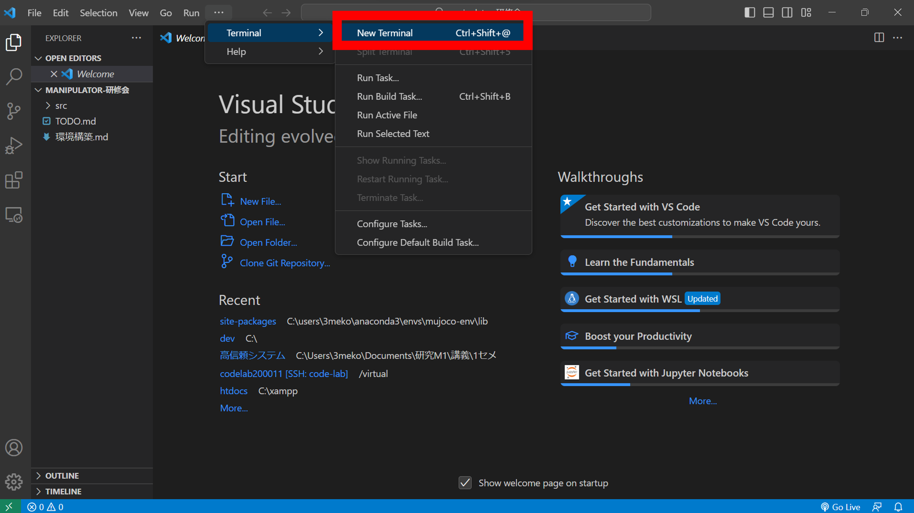
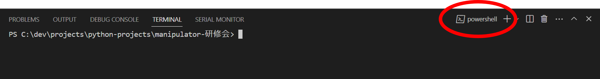
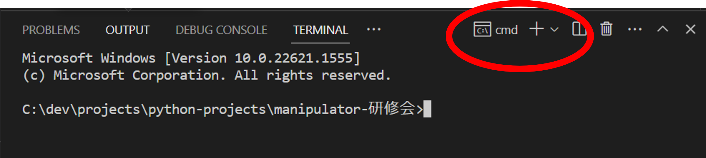
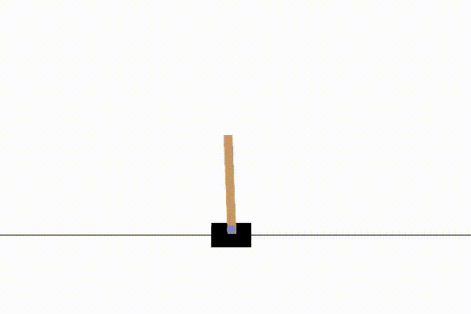

# gymの環境構築

前提としてanacondaとVScodeは入ってるとします

## 1.gymを入れる

gymはシュミレーション用のライブラリ
これがないと始まらない

### 1.1 VSCodeでターミナルを開く

new Terminalをクリックしてターミナルを開きます

### 1.2 コマンドプロンプトを開く

powershellを開いている場合は、comandpromptを選びます

(ダメな例) powershellのとき (windowsはpowershellだとcondaが使えない (なんでかは知らない))

(OKな例) comandpromptのとき (こっちならcondaが使える)

### 1.3 anacondaを有効化する

コマンドプロンプトに以下を入力します

~~~
C:\Users\{ユーザー名}\anaconda3\Scripts\acitvate
~~~

### 1.4 仮想環境を作る&activate

以下のコードをコマンドプロンプトに入力します

~~~
conda create -n manipulator-env python=3.7
conda activate manipulator-env
~~~

- ※pythonはversion3.7にしましょう
- ※windowsでは3.9とかにすると,gymでrender(アニメーションの描画)ができません

これで仮想環境の設定は完了です

### 1.5 gymのインストール

gymを以下のコマンドでインストールします

~~~
pip install gym==0.15.3
~~~

### 1.6 gymが動くか実験

以下のプログラムを実行します

~~~python
import gym
import time

def main():

    env=gym.make("CartPole-v1")
    env.reset()
    for _ in range(100):
        s,_,_,_,=env.step(env.action_space.sample())
        print(s)
        env.render()
        time.sleep(0.1)
    env.close()

if __name__=="__main__":
    main()
~~~

以下のような画面が出てくれば成功です

